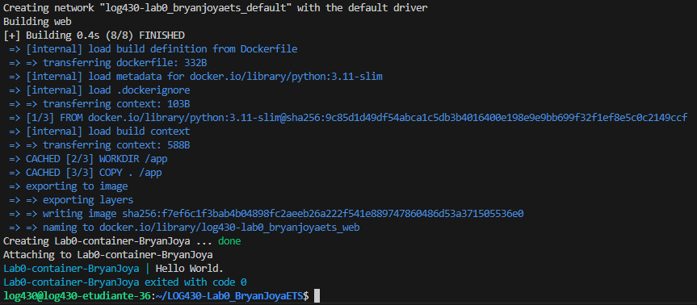

# LOG430-Lab0_BryanJoyaETS

# Hello App

Cette application Python affiche le message `"Hello World"`.
Elle est conçue comme un projet de base pour démontrer :

- l'utilisation de tests unitaires
- la containerisation avec Docker
- la mise en place d'une pipeline CI/CD avec GitHub Actions

cloner le projet : git clone https://github.com/BryanJoyaETS/LOG430-Lab0_BryanJoyaETS.git

---

### Exécuter localement

#### Prérequis :
- Python 3.11
- `pip`
- `pylint`
- `pytest`

#### Dans bash :

sudo apt update
sudo apt install python3 python3-pip -y
pip3 install pylint pytest

### Structure du projet

- LOG430-LAB0BRYANJOYAETS/

-  .github/workflows/ci.yml      # Pipeline CI/CD (GitHub Actions)
-   images                       # Dossier d'images montrant le bon fonctionnement du projet
-  .dockerignore                 # Fichiers ignorés par Docker
-  .gitignore                    # Fichiers ignorés par Git
-  docker-compose.yml            # Lancement du conteneur
-  Dockerfile                    # Image Docker de l’application
-  hello.py                      # Code principal
-  requirements.txt              # Dépendances Python (pylint, pytest)
-  test_hello.py                 # Test unitaire
-  README.md                     

### Construire et lancer le conteneur :

faire le conteneur : docker-compose up --build

curl http://localhost:5000

fermer le conteneur : docker-compose down

### Captures d'écran

