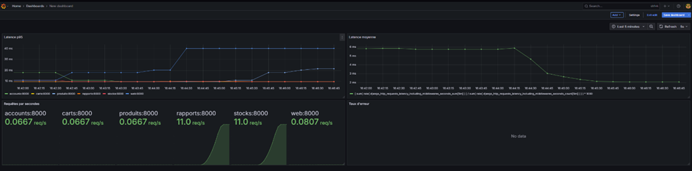

# LOG430-Lab0_BryanJoyaETS

## Laboratoire 5 — Passage à une architecture microservices avec API Gateway et Observabilité

> **Note :** Le fichier de documentation principal se trouve dans  
> [`docs/Laboratoire5/README.md`](../Laboratoire5/README.md)

---

# Microservices – Laboratoire 5

## Résumé  
Dans ce laboratoire, j'ai déployé une architecture micro-services. Chaque service (Produits, Stocks, Carts, Accounts, Reporting) tourne en conteneur et dispose de son propre domaine de responsabilité :  
- **Produits** : Liste des fiches produit et modification 
- **Stocks** : Affichage des stocks des magasins,gestion demandes de réapprovisionnement
- **Carts** : enregistrement des ventes, retours , historique de transaction 
- **Accounts** : création et gestion des comptes clients via les fonctionnalités natives à Django
- **Reporting** : consolidation des rapports de ventes et tableau de bord
- **Application Multi Magasin** : Ex-monolithe, s'occupe de la page principale et de naviguer entre les différents services. Expose aussi toutes ses données.

Un **API Gateway** Nginx assure le routage vers chaque service, applique les règles CORS, et distribue la charge (round-robin). J'ai mis en place :

- **Service Discovery statique** via `upstream` Nginx  
- **Routage** `/api/produits/`, `/api/stock/`, `/api/caisse/`, `/api/clients/`, `/api/rapport/`  
- **En-têtes CORS** globaux (origines et méthodes autorisées)

L’observabilité s’appuie sur **Prometheus** (scraping de tous les `/metrics/` Django) et **Grafana** (dashboards p95, RPS, taux d’erreur), complétée par des tests de montée en charge **k6**.  
Enfin, j'ai  expérimenté un cache Redis sur la vue de stock.

## Objectifs  
1. **Découpage DDD**  
   - Bounded contexts identifiés  
   - Chaque service gère son propre schéma (ou son propre ensemble de tables)  
   - Malheureusement, il est difficile dans mon architecture courante de modifier les données entre plusieurs services. Je ne l'ai donc pas encore faire puisqu'il s'agit de la matière abordé dans le prochain laboratoire.

2. **API Gateway**  
   - Point d’entrée unique  
   - Routage statique vers les micro-services  
   - Politique CORS   

3. **Cache**  
   - Redis + `@cache_page` pour réduire la latence des appels des services  

4. **Tests de charge & observabilité**  
   - Montée en charge progressive avec k6 (30 s→20 VU, 60 s→50 VU, descente)  
   - Seuils p95 < 200 ms, taux d’échecs < 10 %  
   - Dashboards Grafana couvrant RPS, latence p95, taux d’erreur

5. **CI/CD & Infrastructure**  
   - Docker Compose pour tous les services  
   - GitHub Actions (lint, tests, builds Docker)  


## Exécution du projet

```bash
docker compose build --no-cache
RUN_TESTS=false docker compose  up -d
```
---
Une fois l'application démarrée, se rendre à l'adresse pour le site principal:  
[http://localhost:8000](http://localhost:8000)

Mon dashboard Graphana :
[http://localhost:3000/dashboards](http://localhost:3000/dashboards)

Mon scraping Prometheus :

Les targets : [http://10.194.32.198:9090/targets](http://10.194.32.198:9090/targets)

ADRs : 

[`docs/Laboratoire5/ADR`](../Laboratoire5/ADR/001.md) ainsi que les autres dans le même dossier


---


## Clonage des laboratoires précédents

- **Laboratoire 0 :**  
  `git clone` https://github.com/BryanJoyaETS/LOG430-Lab0_BryanJoyaETS/releases/tag/Lab0
- **Laboratoire 1 :**  
  `git clone` https://github.com/BryanJoyaETS/LOG430-Lab0_BryanJoyaETS/releases/tag/Lab1
- **Laboratoire 2 :**  
  `git clone` https://github.com/BryanJoyaETS/LOG430-Lab0_BryanJoyaETS/releases/tag/Lab2
- **Laboratoire 3 :**  
  `git clone` https://github.com/BryanJoyaETS/LOG430-Lab0_BryanJoyaETS/releases/tag/Lab3
- **Laboratoire 4 :**  
  `git clone` https://github.com/BryanJoyaETS/LOG430-Lab0_BryanJoyaETS/releases/tag/Lab4
- **Laboratoire 5 :**  
  `git clone` https://github.com/BryanJoyaETS/LOG430-Lab0_BryanJoyaETS/releases/tag/Lab5

---

## Structure du projet : 
```
├── nginx/nginx.conf                # config Nginx
├── produits-service/               # Micro service faisant la gestion des produits
├── stocks-service/                 # Micro service faisant la gestion des stocks
├── carts-service/                  # Micro service faisant la gestion des ventes, historique et retours
├── accounts-service/               # Micro service faisant la gestion des comptes utilisateurs
├── reporting-service/              # Micro service faisant la gestion des rapports de ventes et tableaux de bords
├── Application_Multi_Magasin/      # Mon ancien Monolithe qui expose toutes ses données pour les autres services
├── monitoring/                     # prometheus.yml
├── k6/                             # scripts de charge k6
├── docker-compose.yml  
└── README.md
```


## Analyse k6 et Graphana

k6 run k6/load-test.js

         /\      Grafana   /‾‾/  
    /\  /  \     |\  __   /  /   
   /  \/    \    | |/ /  /   ‾‾\ 
  /          \   |   (  |  (‾)  |
 / __________ \  |_|\_\  \_____/ 

     execution: local
        script: k6/load-test.js
        output: -

     scenarios: (100.00%) 1 scenario, 50 max VUs, 2m30s max duration (incl. graceful stop):
              * default: Up to 50 looping VUs for 2m0s over 3 stages (gracefulRampDown: 30s, gracefulStop: 30s)


  █ THRESHOLDS 

    http_req_duration
    ✓ 'p(95)<20000' p(95)=18.24ms

    http_req_failed
    ✓ 'rate<0.10' rate=0.00%


  █ TOTAL RESULTS 

    checks_total.......................: 6212    51.675963/s
    checks_succeeded...................: 100.00% 6212 out of 6212
    checks_failed......................: 0.00%   0 out of 6212

    ✓ stock 200
    ✓ rapport ventes 200

    HTTP
    http_req_duration.......................................................: avg=8.17ms min=2.03ms med=6.27ms max=182.68ms p(90)=14.31ms p(95)=18.24ms
      { expected_response:true }............................................: avg=8.17ms min=2.03ms med=6.27ms max=182.68ms p(90)=14.31ms p(95)=18.24ms
    http_req_failed.........................................................: 0.00%  0 out of 6212
    http_reqs...............................................................: 6212   51.675963/s

    EXECUTION
    iteration_duration......................................................: avg=1.01s  min=1s     med=1.01s  max=1.21s    p(90)=1.02s   p(95)=1.03s  
    iterations..............................................................: 3106   25.837981/s
    vus.....................................................................: 1      min=1         max=50
    vus_max.................................................................: 50     min=50        max=50

    NETWORK
    data_received...........................................................: 25 MB  203 kB/s
    data_sent...............................................................: 730 kB 6.1 kB/s


running (2m00.2s), 00/50 VUs, 3106 complete and 0 interrupted iterations
default ✓ [======================================] 00/50 VUs  2m0s


| Mesure                 | Avant (monolithe + LB)                                             | Après (micro‑services + LB)                                        |
|------------------------|---------------------------------------------------------------------|--------------------------------------------------------------------|
| **p95 latence**        | ~ 7 010 ms (seuil visé p95 < 500 ms non atteint)                   | ~ 18 ms (seuil p95 < 20 000 ms largement respecté)                 |
| **Latence moyenne**    | ~ 6 290 ms                                                          | ~ 8 ms                                                             |
| **RPS (débit)**        | ~ 2,98 req/s                                                        | ~ 51,6 req/s                                                       |
| **Taux d’erreur**      | 0 %                                                                 | 0 %                                                                |
| **VU max**             | 20                                                                  | 50                                                                 |
| **Itérations complètes** | 307 (environ 1 min)                                               | 6 212 (environ 2 min)                                             |

---

### 1. Avant (Monolithe + Load Balancer Nginx)
- **Configuration** : une unique instance Django servie derrière Nginx en round‑robin (1 réplique).  
- **Résultats k6** :  
  - 20 VUs simulés → 0 % d’erreur  
  - p95 ≃ 7 s, RPS ≃ 3 req/s  
- **Limites** :  
  - Goulot unique (une seule application)  
  - Absence de cache  
  - Charge CPU/mémoire saturée  

### 2. Après (Micro‑services + Load Balancer Nginx + Cache)
- **Configuration** :  
  - 5 services conteneurisés (Produits, Stocks, Carts, Accounts, Reporting)  
  - **Redis** pour le cache  
  - **Nginx** répartissant la charge sur les services  
- **Résultats k6** :  
  - Jusqu’à 50 VUs → 0 % d’erreur  
  - p95 ≃ 18 ms, latence moyenne ≃ 8 ms  
  - RPS ≃ 51 req/s  


